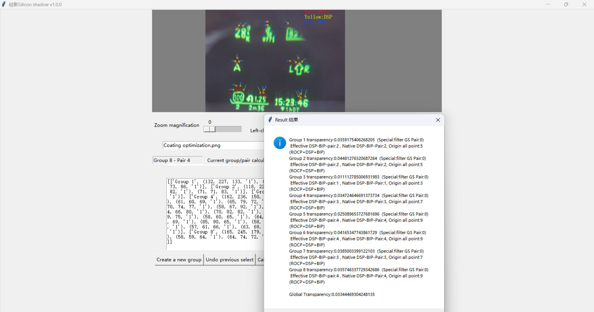
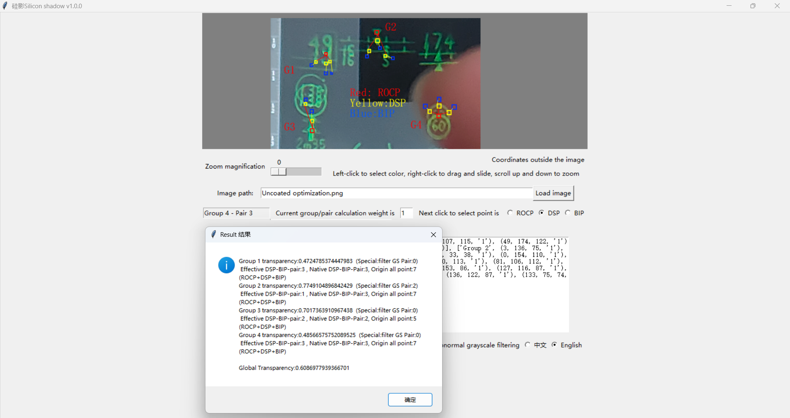

# Tool Description

**Silicon Shadow (siliconshadow)** is a relative transparency calculation and evaluation algorithm based on the Rec.709 color standard. It is designed to quantitatively measure the transparency of ghost images (stray light) in lens projection, especially for custom optical lens groups with a small number of elements and complex structures (non‑one‑dimensional optical paths) that are prone to internal reflections. The background of this project originated from the requirements and specifications for optical lens groups in a self‑developed reflective HMS (Head‑Up Display) system. The tool implements a semi‑automated workflow for point selection, RGB value acquisition, and visualised computation.

## Folder Structure

- `siliconshadowv1.0.0.py` – the source code.
- `Input_your_path with the format.png` – a default sample image for testing (identical content to `Coating optimization.png`).
- `Coating optimization.png` – test image with an optimised anti‑reflection coating (transparency ≈ 5%).
- `Uncoated optimization.png` – test image without anti‑reflection coating (transparency ≈ 60%).
- `readme.md` – this documentation file.
- `readme_zh.md` – the Chinese original instruction documentation.

`Coating optimization.png` test like:

`Uncoated optimization.png`test like:

## Core Principle

The information light source passes through the lens group by refraction; at the same time, multiple internal reflections occur between the lenses. The brightness of the reflected ghost light reaching the eye is lower than that of the direct refracted light. When the background light is dimmer than the ghost light, we can approximately decompose the light using the additive colour mixing model to isolate the ghost light brightness, thereby calculating the transparency quantitatively – providing a data basis for optical structure optimisation.

**Example analogy:**  
Suppose the original information source intensity is 100. The effective refracted light reaching the eye is 80. The background light intensity in the captured test image is 15. The ghost light (multiple reflections + superimposed background) has an intensity of 30.  
Then the ghost transparency relative to the background is:  
(30 − 15) / (80 − 15) ≈ 23%.

## Detailed Algorithm Flow

Based on the sRGB colour space, several groups of data are collected. Each group contains three types of points:

- **ROCP** – Reference Original Colour Point (基准原色点)
- **DSP** – Dispersion Reference Point (色散参考点)
- **BIP** – Background Interference Point (背景干扰点)

The relationship within a group is **1 : n : n** (one ROCP, n DSPs, n BIPs).  
For each point, the original coordinates are recorded, and the RGB values are retrieved. The processing pipeline is as follows (LaTex):

1. **Normalise** each channel to [0, 1]:

V_{linear} = \frac{X}{255}

2. **Inverse Gamma Correction** (to recover linear physical brightness from the non‑linear sRGB encoding):

V_{linear} = \begin{cases} \frac{V_{nonlinear}}{12.92}, & V_{nonlinear} \le 0.04045 \\ \left(\frac{V_{nonlinear} + 0.055}{1.055}\right)^{2.4}, & V_{nonlinear} > 0.04045 \end{cases}

3. **Compute grayscale brightness** using the Rec.709 luminance coefficients and scale back to 0–255:

G_{i} = 0.2126 \cdot R_{linear} \cdot 255 + 0.7152 \cdot G_{linear} \cdot 255 + 0.0722 \cdot B_{linear} \cdot 255

4. **Calculate the relative ghost transparency** (α) for each DSP‑BIP pair against the ROCP and background  (R:ROCP, D:DSP, B:BIP):

\alpha = \frac{G_{D} - G_{B}}{G_{R} - G_{B}}

## Usage Instructions

Run the Python file. A `Compute` class instance is pre‑instantiated with the root Tkinter window.  
Default window size: `854×720`.  
Default placeholder image: a solid grey image (128, 128, 128).

### Image Loading & Viewport Controls
- **Load** an image by entering its path and clicking the "Load Image" button.
- The image appears on the canvas.
- **Left‑click** on the canvas to pick a colour (the RGB value and original image coordinates are shown).
- **Right‑click and drag** to pan the view.
- **Mouse wheel** to zoom in/out.

### Data Recording
- **Create a new group** by clicking the corresponding button – this starts a new data group.
- The required order of point selection within a group is:
  1. **ROCP** (one per group)
  2. **DSP** (first pair)
  3. **BIP** (first pair)
  4. **DSP** (second pair)
  5. **BIP** (second pair)
  6. … and so on.
- To start a new group, click “Create a new group” again.
- **Undo** the last point selection is supported.
- The interface shows a hint for the next point type to select.

### Calculation & Results
After all points are selected, click **“Calculate”**. The tool displays:
- Transparency value for each group.
- Number of effective DSP‑BIP pairs used (after filtering).
- Total weighted global transparency.

### Additional Features
- **Language switching** between Chinese and English.
- **Beep sound** on group creation / point selection / undo (can be toggled on/off).
- **Abnormal grayscale filtering** – when enabled, discards pairs where linear brightness exceeds [0, 255] or computed transparency falls outside [0, 1]. Disable this for debugging.
- **Optical weight** for each group and each point pair (default = 1, range 0–1). When all are 1, it acts like an **evaluative metering** (equal weight). Adjusting weights allows **centre‑weighted averaging** (e.g., giving higher confidence to central groups).

### Weighted Averaging Calculation
1. Within each group, pair weights are normalised (sum to 1) to compute the group’s transparency.
2. Group weights are then normalised globally to obtain the final weighted transparency.

## Additional Notes & Boundary Conditions

1. **Image quality:** Python resampling may degrade image quality. It is recommended to mark measurement points before applying the tool.

2. **Point selection area:** Use an inner box of at least 4×4 pixels to avoid accidental border or gradient errors.

3. **Adjustable parameters:** The code allows tuning `MAX_VAL`, `MIN_VAL`, `AMP_SENSITIVITY`, `RDC_SENSITIVITY`. Beware of interference that might cause `MIN_VAL` to become 0, leading to division‑by‑zero errors.

4. **High‑magnification lag:** The visual sluggishness at high zoom is partly due to the mouse‑step‑to‑pixel perception, but the main cause is the real‑time full‑resolution LANCZOS resampling. For a 12‑megapixel image (4000×3000) magnified 4×, the processed image becomes ~192 megapixels (16000×12000), overloading the CPU. To mitigate, reduce magnification or implement a cached‑resize strategy (move only during dragging, re‑sample only on release/zoom).

5. **Incomplete pairs:** Any trailing points that do not form a complete DSP‑BIP pair are discarded (e.g., if a group has 0,1‑1,2‑2, and a single 3, point 3 is ignored).

6. **Invalid optical weights:** Groups or pairs with weights outside (0,1] are automatically filtered out (not cancelable).

7. **Abnormal grayscale/transparency:** If enabled, pairs where calculated brightness or transparency falls outside the physical range are filtered. Turning off this filter is useful for debugging.

8. **Additive colour mixing assumption:** The method requires that the captured image satisfies **signal light > ghost light > background light** – otherwise the calculated values become physically meaningless. This condition holds naturally for HUD/HMS systems using LED displays. **This tool is designed for “bright‑bright‑dark” transparency, not for “bright‑dark‑dark” transmittance.** Using a negative image to compute transmittance would produce unreliable results.

9. **Data display frame:** The `frame_realtime_data_disp` method has a parameter `RD_ONLY` (default `True`). Setting it to `False` allows copying the selection‑list data for external manipulation, but modifying the displayed text does **not** affect the actual stored data.

10. **Internal data structures:**  
    - `temp_data` – a filtered copy of `self.Stat_Data` after optical‑weight screening; format: `[['Group name', (R, G, B, 'weight')], ...]`.  
    - `leach_data` – a union list derived from `temp_data` after removing abnormal‑brightness pairs (e.g., when a DSP was accidentally chosen darker than its corresponding BIP, producing negative alpha). Its format is either `[['Group name', error_code]]` or `[['Group name', (alpha, optical_weight, idx)]]`.  
    The use of two parallel lists with index binding supports future extensions such as automated weight assignment based on distance from the image centre (simulating evaluative/centre‑weighted/spot metering).

## Visualisation – Real‑time Zoom & Pan Mechanism (Summary&Memo)

**Canvas coordinate system:** current coordinate, offset, mouse displacement (delta), initial width/height.  
**Image coordinate system:** original coordinate.

- **① Initialisation:** The image is anchored at the top‑left (NW). After loading, the actual size is read and `fpic_update` is called.

- **② Resampling:** The function has two parts – scaling (resample) and scrolling. Scaling uses `scale` to compute new dimensions, applies LANCZOS resampling, stores the `PhotoImage`, resets offsets to 0, clears canvas, and redraws.

- **③ Drag:** On right‑button press, the current offset and mouse position are stored. On drag motion, the new offset = old offset + mouse displacement. The canvas is updated by calling `fpic_update` (which re‑resamples, though the image content remains unchanged – this can be optimised).

- **④ Zoom:** Mouse wheel direction determines zoom in/out. The scale is multiplied by sensitivity factors, clamped by `MIN_VAL` and `MAX_VAL`. The original image coordinate under the mouse pointer is calculated as `(mouse_x - offset_x) / current_scale`. Then the new offsets are computed to keep that point fixed. `fpic_update` is called to redraw.

- **⑤ Click to pick colour:** The same coordinate transformation is applied to get original coordinates. The point is considered valid if it lies within the image dimensions.